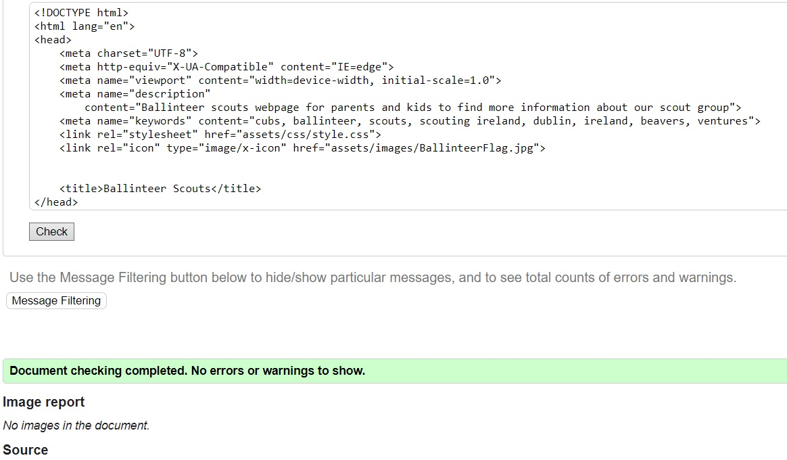

# Ballinteer Scouts

Ballinteer scouts is a website that aims to help people/parents of children get more information about the group. The site will target parents that are looking to get their children involved in scouts. It will give information about the age groups of each section within the group.

[Live webpage](https://paulnolan90.github.io/p1-scoutinggroup/index.html)

## Table of Content

1. [Project Goals](#project-goals)
    1. [Owner objectives](#owner-objectives)
    2. [User objectives](#user-objectives)
2. [User Experience](#user-experience)
    1. [First time users](#first-time-users)
    2. [Returning Users](#returning-users)
    3. [Target Audience](#target-audience)
3. [Features](#features)
    1. [Existing Features](#existing-features)
    2. [Features to Implement](#features-to-implement)
4. [Technologies Used](#technologies-used)
    1. [Languages](#languages)
    2. [Frameworks & Tools](#frameworks-and-tools)
5. [Design](#design)
    1. [Design Choices](#design-choices)
    2. [Colour](#colours)
    3. [Fonts](#fonts)
    4. [Structure](#structure)
6. [Testing](#testing)
    1. [HTML Validation](#HTML-validation)
    2. [CSS Validation](#CSS-validation)
    3. [Accessibility](#accessibility)
    4. [Performance](#performance)
    5. [Device testing](#performing-tests-on-various-devices)
    6. [Browser compatibility](#browser-compatability)
    7. [Testing user stories](#testing-user-stories)
8. [Bugs](#Bugs)
9. [Deployment](#deployment)
10. [Credits](#credits)
11. [Acknowledgements](#acknowledgements)

## Project Goals 

### Owner objectives
- Increase awarness of a scout group in Ballinteer.
- Make it easier to share information with parents.
- Provide a way for new parents to contact the group.
- Provide information to new parents/kids on what we do.

### User objectives
- Finding a scout group for their child.
- See a full list of age groups within the troop.
- Find information about what those groups do.
- Find the location of the scout den.
- submit a form with their details.

## User Experience
### First Time users 
1. First time users should be able to understand that we are a scout group located in Ballinteer.
2. First time users should be able to find what age groups we look after.
3. First time users should be able to find our location.
4. First time users should be able to see which group meets at which time.
5. First time users should be able to fill in a form with their details for a callback from leaders.

### Returning Users
1. Returning users should be able to find the location of the scout den.
2. Returning users should be able to check the times that their group meets at.
3. Returning users should be able to check the day that their group meets at.

 

### Target Audience
- People looking for something new for their kids that isnt sport.
- People looking to find information on ballinteer scouts.
- People trying to find our location.

## Features 

The Website contains 3 pages with 8 features

### Existing Features

- __Navigation Bar__

  - The navigation bar is featured on all three pages. It is identical on each and is set to be sticky for easier navigation throughout the site.
  - The navigation bar contains the name of the website which is also a link back to the homepage. It also contains three links “Home” “Find us” & “Join the adventure!”. These links are responsive when hovered over to present an underline and overline that provides good feedback to the user that they are clicking the right place.

- __Home page big image__

  - The home page displays an image of mountains, with an overlay of the Irish scouting logo with “115th Ballinteer” and “expect the unexpected!” text appearing slowly to grab the user’s attention.
  - This image introduces the user to Ballinteer scouts with an animated image that zooms slowly away and fades in the text.

- __Our Groups Section__

  - The Groups section will give users information on the age range for our different groups within Ballinteer scouts, it will also give a small introduction to what each group does throughout the year.
  - The user will also see images of each of the age groups having fun and enjoying themselves

- __Group Weekdays/Times__

  - This section shows which group meetup on which day and what time they meet, all meetings are in Ballinteer scout den so I did not put the location as I have a separate “Find us” page.

- __The Footer__ 

  - The footer section has 4 images representing the 4 main social media channels, these social media accounts provide further enchantment for the user to see what Ballinteer scouts are about.

- __Find us Page__

  - The Find us page will present a google map, that will show where we are located in Ballinteer.
  - This section is of high importance as we are slightly hidden away from the road and this will make the user’s experience easier. It also shows our address plus Eircode.
 

- __Find us Page__

  - This page will allow the user to sign up for Ballinteer scouts and get a call back from one of the leaders depending on which section they choose in the form.
  - The form asks for the parent’s details and the child’s details that they wish to get involved.
 

For some/all of your features, you may choose to reference the specific project files that implement them.

In addition, you may also use this section to discuss plans for additional features to be implemented in the future:

### Features to Implement

- COME BACK TO THIS

## Technologies Used
### Languages

- HTML
- CSS

### Frameworks and Tools

- Git
- GitHub
- Font awesome
- Google Fonts
- Git
- Canva palette generator
- GIMP image editing software

## Design

### Design Choices
The main focus when desigining the website was for easy navigation, after completeing this I wanted to make sure that it looked modern whilst also looking slihghtly outdoorsy as it is a scout group after all.

### Colours
The colour scheme was picked to represent the outdoor aspect of the group while also representing the colors used on ballinteers neckerchief.

### Fonts
Merriweather was used for the headings while Robotto was used in the paragraphs.

### Structure

The website was designed in a traditional way with the logo to top left and the navigation links to the far right, the navigation links were designed with an underline+overline when hovered over so that they are extremely responsive.

The Navigation bar turns into a "burger" menu when the viewed on a mobile screen which when clicked slides across the screeen to reveal the 3 options.

The webiste has 3 pages:
1. a home page with a big image with text appearing to capture the user.
2. a find us page that shows our location on a google map.
3. a form page that allows parents to submit a form with their details plus their childs for a call back from a leader.

## Testing 

### HTML Validation 

Home

    
    

### Validator Testing 

- HTML
  - No errors were returned when passing through the official [W3C validator](https://validator.w3.org/nu/?doc=https%3A%2F%2Fcode-institute-org.github.io%2Flove-running-2.0%2Findex.html)
- CSS
  - No errors were found when passing through the official [(Jigsaw) validator](https://jigsaw.w3.org/css-validator/validator?uri=https%3A%2F%2Fvalidator.w3.org%2Fnu%2F%3Fdoc%3Dhttps%253A%252F%252Fcode-institute-org.github.io%252Flove-running-2.0%252Findex.html&profile=css3svg&usermedium=all&warning=1&vextwarning=&lang=en#css)

### Unfixed Bugs

You will need to mention unfixed bugs and why they were not fixed. This section should include shortcomings of the frameworks or technologies used. Although time can be a big variable to consider, paucity of time and difficulty understanding implementation is not a valid reason to leave bugs unfixed. 

## Deployment

This section should describe the process you went through to deploy the project to a hosting platform (e.g. GitHub) 

- The site was deployed to GitHub pages. The steps to deploy are as follows: 
  - In the GitHub repository, navigate to the Settings tab 
  - From the source section drop-down menu, select the Master Branch
  - Once the master branch has been selected, the page will be automatically refreshed with a detailed ribbon display to indicate the successful deployment. 

The live link can be found here - https://code-institute-org.github.io/love-running-2.0/index.html 

## Credits 

In this section you need to reference where you got your content, media and extra help from. It is common practice to use code from other repositories and tutorials, however, it is important to be very specific about these sources to avoid plagiarism. 

You can break the credits section up into Content and Media, depending on what you have included in your project. 

### Content 

- The text for the Home page was taken from Wikipedia Article A
- Instructions on how to implement form validation on the Sign Up page was taken from [Specific YouTube Tutorial](https://www.youtube.com/)
- The icons in the footer were taken from [Font Awesome](https://fontawesome.com/)

### Media

- The photos used on the home and sign up page are from This Open Source site
- The images used for the gallery page were taken from this other open source site

Congratulations on completing your Readme, you have made another big stride in the direction of being a developer! 

## Other General Project Advice

Below you will find a couple of extra tips that may be helpful when completing your project. Remember that each of these projects will become part of your final portfolio so it’s important to allow enough time to showcase your best work! 

- One of the most basic elements of keeping a healthy commit history is with the commit message. When getting started with your project, read through [this article](https://chris.beams.io/posts/git-commit/) by Chris Beams on How to Write  a Git Commit Message 
  - Make sure to keep the messages in the imperative mood 

- When naming the files in your project directory, make sure to consider meaningful naming of files, point to specific names and sections of content.
  - For example, instead of naming an image used ‘image1.png’ consider naming it ‘landing_page_img.png’. This will ensure that there are clear file paths kept. 

- Do some extra research on good and bad coding practices, there are a handful of useful articles to read, consider reviewing the following list when getting started:
  - [Writing Your Best Code](https://learn.shayhowe.com/html-css/writing-your-best-code/)
  - [HTML & CSS Coding Best Practices](https://medium.com/@inceptiondj.info/html-css-coding-best-practice-fadb9870a00f)
  - [Google HTML/CSS Style Guide](https://google.github.io/styleguide/htmlcssguide.html#General)

Getting started with your Portfolio Projects can be daunting, planning your project can make it a lot easier to tackle, take small steps to reach the final outcome and enjoy the process! 